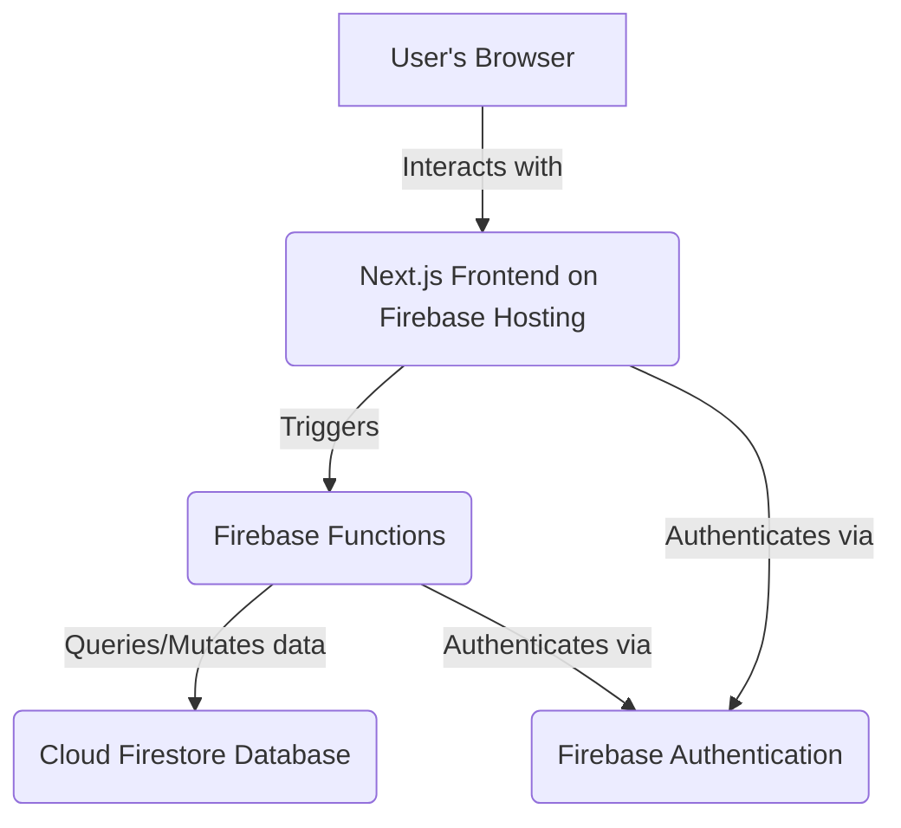
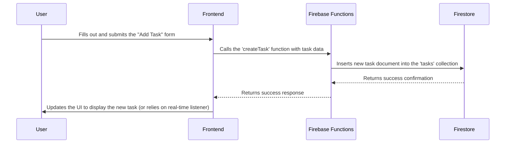

# Wedding Planner Web App Design

## 1. Architecture

The application will be a modern web application using a Next.js frontend and a serverless backend powered by Firebase. This architecture is chosen for its scalability, real-time data capabilities, and seamless integration between frontend and backend services.

### 1.1. System Components Diagram

This diagram illustrates the high-level architecture of the system.

### 1.2. Technology Stack

| Category | Technology | Justification |
| :--- | :--- | :--- |
| **Core Framework** | **Next.js 15+** | A full-stack React framework that provides a robust foundation for a fast, SEO-friendly, and dynamic application. |
| **Language** | **TypeScript** | Enhances code quality and maintainability with static typing. |
| **Frontend** | **React** | Used within Next.js to build a component-based, interactive, and modern user interface. |
| **Backend** | **Firebase Functions** | Provides a scalable, serverless backend for handling API requests and business logic. |
| **Database** | **Cloud Firestore** | A flexible, scalable NoSQL database that integrates seamlessly with Firebase and provides real-time data synchronization. |
| **Styling** | **Tailwind CSS & Shadcn/ui** | A utility-first CSS framework for rapid, custom UI development, combined with a library of beautifully designed and accessible components. |
| **Authentication** | **Firebase Authentication** | A secure and easy-to-use service for managing user sign-up and login. |
| **Deployment** | **Firebase Hosting** | Provides fast and secure hosting for the web app, with a global CDN and easy integration with other Firebase services. |

## 2. Components

The application will be built using a component-based architecture. The component structure remains the same as the previous design.

### 2.1. UI Components (Shared)

*   **Button, Card, Input, Modal, ThemeToggle, Tabs**

### 2.2. Feature Components

*   **Dashboard:** (CountdownTimer, ProgressCard, GuestSummaryCard)
*   **ToDoList:** (TaskForm, TaskList, TaskItem, TaskDetailModal)
*   **GuestList:** (GuestForm, GuestTable, GuestItem)
*   **Invitation:** (InvitationModal)

## 3. User Flow Example: Adding a Task

This sequence diagram illustrates the process of a user adding a new task using Firebase.

## 4. Data Model (Firestore)

The database will use a NoSQL structure with collections and documents.

*   **users** (collection)
    *   `{userId}` (document)
        *   `email`
        *   `createdAt`
*   **tasks** (sub-collection under each user)
    *   `{taskId}` (document)
        *   `title`
        *   `completed`
        *   `priority`
        *   `notes`
        *   `subtasks` (array of maps)
*   **guests** (sub-collection under each user)
    *   `{guestId}` (document)
        *   `name`
        *   `email`
        *   `status` (e.g., 'Pending', 'Invited', 'Attending')