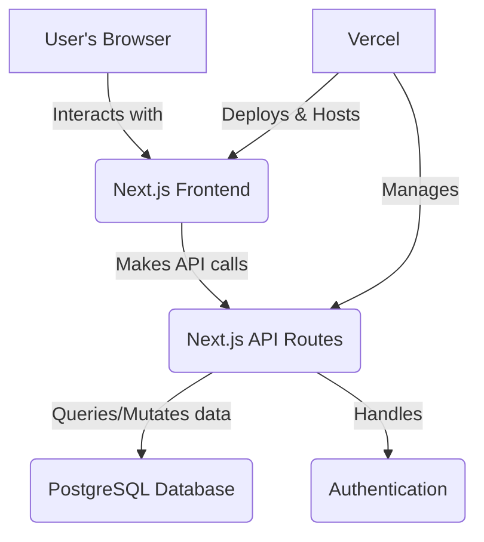
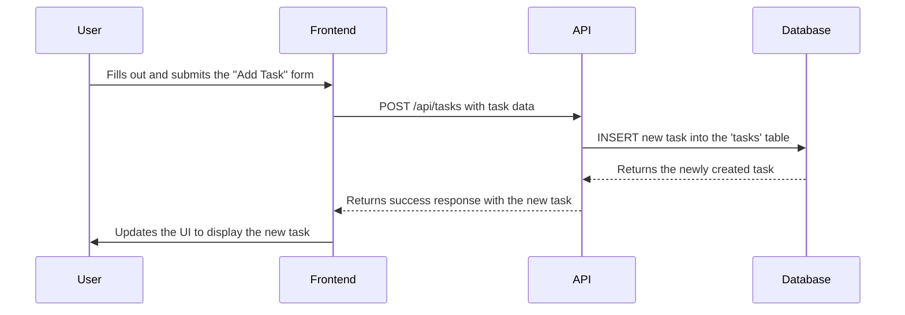

# Wedding Planner Web App Design

## 1. Architecture

The application will be a monolithic, full-stack web application built with Next.js. This architecture is chosen for its simplicity, efficiency, and the seamless development experience it offers by unifying the frontend and backend in a single codebase.

### 1.1. System Components Diagram

This diagram illustrates the high-level architecture of the system.

### 1.2. Technology Stack

| Category | Technology | Justification |
| :--- | :--- | :--- |
| **Core Framework** | **Next.js 15+** | A full-stack React framework that provides a robust foundation for a fast, SEO-friendly, and dynamic application. |
| **Language** | **TypeScript** | Enhances code quality and maintainability with static typing, which is crucial for a complex application. |
| **Frontend** | **React** | Used within Next.js to build a component-based, interactive, and modern user interface. |
| **Backend** | **Node.js (via Next.js API Routes)** | Keeps the entire application within a single, unified codebase, which is highly efficient for this project's scale. |
| **Database** | **PostgreSQL** | A powerful, open-source relational database ideal for managing the structured and relational data of a wedding planner (guests, tasks, etc.). |
| **Styling** | **Tailwind CSS & Shadcn/ui** | A utility-first CSS framework for rapid, custom UI development, combined with a library of beautifully designed and accessible components. |
| **Authentication** | **Auth.js (NextAuth.js)** | A flexible, open-source authentication solution designed for Next.js, providing secure and easy-to-implement user authentication. |
| **Deployment** | **Vercel** | Offers a seamless, zero-configuration deployment experience optimized for Next.js applications, with automatic CI/CD and scaling. |

## 2. Components

The application will be built using a component-based architecture. Here are the primary components:

### 2.1. UI Components (Shared)

*   **Button:** A customizable button component for various actions.
*   **Card:** A container for displaying content sections.
*   **Input:** A styled input field for forms.
*   **Modal:** A dialog component for displaying information or forms.
*   **ThemeToggle:** A button to switch between light and dark modes.
*   **Tabs:** A component for navigating between different sections of the app.

### 2.2. Feature Components

*   **Dashboard:**
    *   **CountdownTimer:** Displays the time remaining until the wedding day.
    *   **ProgressCard:** Shows the progress of the to-do list.
    *   **GuestSummaryCard:** Displays the total number of guests.
*   **ToDoList:**
    *   **TaskForm:** A form to add new tasks.
    *   **TaskList:** Displays the list of tasks, organized by priority.
    *   **TaskItem:** Represents a single task in the list.
    *   **TaskDetailModal:** A modal to view and edit task details, notes, and sub-tasks.
*   **GuestList:**
    *   **GuestForm:** A form to add new guests.
    *   **GuestTable:** Displays the list of guests.
    *   **GuestItem:** Represents a single guest in the table.
*   **Invitation:**
    *   **InvitationModal:** A modal to preview and send the wedding invitation.

## 3. User Flow Example: Adding a Task

This sequence diagram illustrates the process of a user adding a new task.

## 4. Data Model

The database will have the following primary tables:

*   **users:** Stores user account information.
    *   `id` (PK)
    *   `email`
    *   `password_hash`
*   **tasks:** Stores to-do list items.
    *   `id` (PK)
    *   `user_id` (FK to users)
    *   `title`
    *   `completed`
    *   `priority`
    *   `notes`
    *   `subtasks` (JSONB)
*   **guests:** Stores guest information.
    *   `id` (PK)
    *   `user_id` (FK to users)
    *   `name`
    *   `email`
    *   `status` (e.g., 'Pending', 'Invited', 'Attending')
